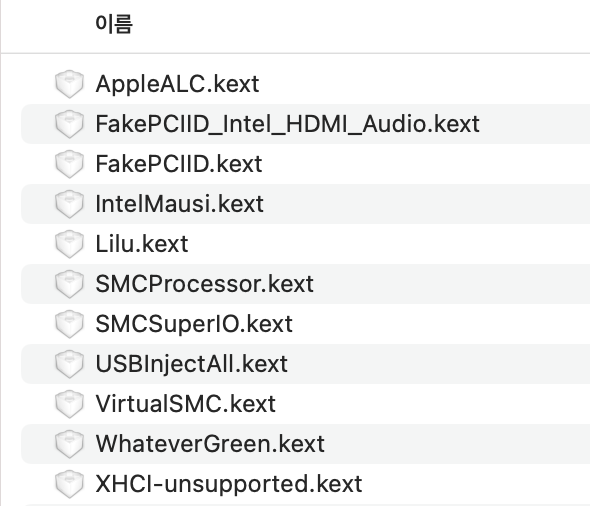

# Hackintosh

10400 - B460M Aorus Elite

## Hardware

CPU : I5 - 10400

Mainboard : GIGABYTE B460M Aorus Elite

GPU : UHD 630 (Internal graphics)

SSD : Samsung EVO 860 250G

RAM : Samsung 16G

## Bootloader

OpenCore

## KEXT

## BIOS Setting

Enable: 
- VT-x
- Above 4G decoding
- Hyper-Threading
- EHCI/XHCI Hand-off
- OS type: (Windows 10 Feautres: Ohter)
- DVMT Pre-Allocated(iGPU Memory): 64MB

Disable:

- Fast Boot
- VT-d
- CSM
- Thunderbolt
- Intel SGX
- Intel Platform Trust
- CFG Lock

I wanted to use Internal graphic.